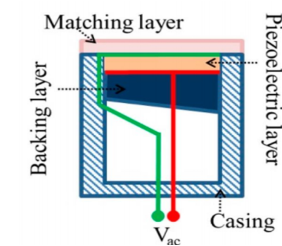
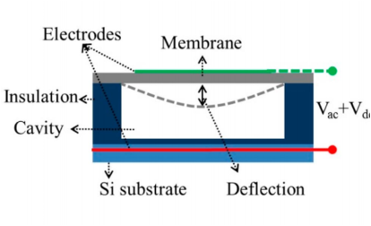
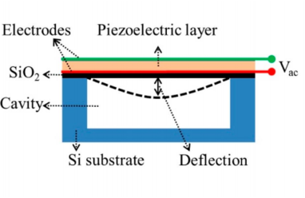

# 概述

## MEMS-PMUT 简介

Micro-Electro-Mechanical Systems（MEMS，微机电系统）是一种利用微制造技术生产的微型器件，其在换能领域（换能器件包括传感器 Sensor 与执行器 Actuator）具有显著的优越性。  
MEMS 应用非常广泛，包括：

- 传感器（惯性传感器、压力传感器、磁场传感器、光学传感器……）
- 执行器（微型镜、微泵、微阀……）
- 既作为传感器又作为执行器的微机械超声换能器（Micromachined Ultrasonic Transducers，MUT）
- 射频器件（Radio Frequency Device, RF）及其他

PMUT 属于：

换能器 → 超声换能器  
          MEMS 技术 → 微机械超声换能器（MUT）  
                      → 压电微机械超声换能器（Piezoelectric Micromachined Ultrasonic Transducer，PMUT）

PMUT 是利用 MEMS 技术制造的，既可作为传感器也可作为执行器，基于压电效应振动的超声换能器。

相比传统超声换能器，PMUT 的优势包括：

- 更小的尺寸  
- 更低的功耗  
- 可以在空气和水中运行  
- 更高的集成度  

## 压电陶瓷、CMUT、PMUT 之对比

当然，超声换能器不只有基于压电效应的。其他还有：

- 压电陶瓷换能器（即用 piezoelectric ceramics 制成的 bulk piezoelectric transducer）  
- 电容式微机械超声换能器（Capacitive Micromachined Ultrasonic Transducer，CMUT）

下表展示了三者的特性对比：

---

### 三者工作模式简介

- **压电陶瓷**：  
  利用压电效应，通过 z 方向电场产生 z 方向应变振动，为 d₃₃ 模态（指标3代表 z 方向电场，第二个指标3代表 z 方向应变），也称“厚度模式”。

- **PMUT**：  
  利用压电效应，通过 z 方向电场产生 x 方向应变振动，为 d₃₁ 模态（指标3代表 z 方向电场，指标1代表 x 方向应变）。  
  压电层 x 方向的拉伸会引起下方的被动层（passive layer）上下弯曲，工作模式称为“挠曲振动模式”。  
  后续将详细讲解压电效应及 PMUT 的挠曲振动模式。

- **CMUT**：  
  通过静电力吸引电容顶电极，使振膜弯曲振动，也是挠曲振动模式。

---

### 压电陶瓷、CMUT 和 PMUT 特性对比表

| 特性           | 压电陶瓷       | CMUT                     | PMUT                     |
|----------------|----------------|--------------------------|--------------------------|
| 示意图         |  |          |          |
| 工作模式       | 厚度模式       | 挠曲振动模式             | 挠曲振动模式             |
| 频率范围       | 有限           | 较广                     | 较广                     |
| 输出功率       | 高             | 低                       | 中等                     |
| 带宽           | 窄             | 宽                       | 中等                     |
| 直流偏置要求   | 不需要         | 需要                     | 通常不需要               |
| 制造复杂性     | 简单           | 高                       | 中等                     |
| 小型化能力     | 有限           | 优                       | 优                       |
| 阻抗匹配       | 有限           | 优                       | 优                       |
| 应用           | 工业、治疗、成像 | 高分辨率成像、传感       | 可穿戴设备、传感         |

> 表 1.1：压电陶瓷、CMUT 和 PMUT 特性对比表