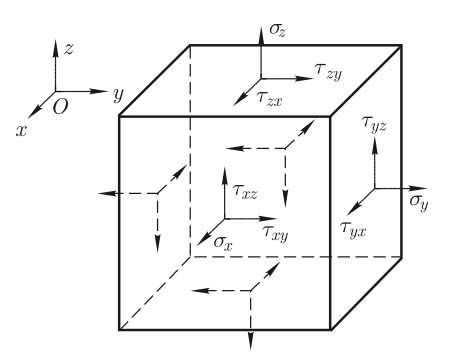
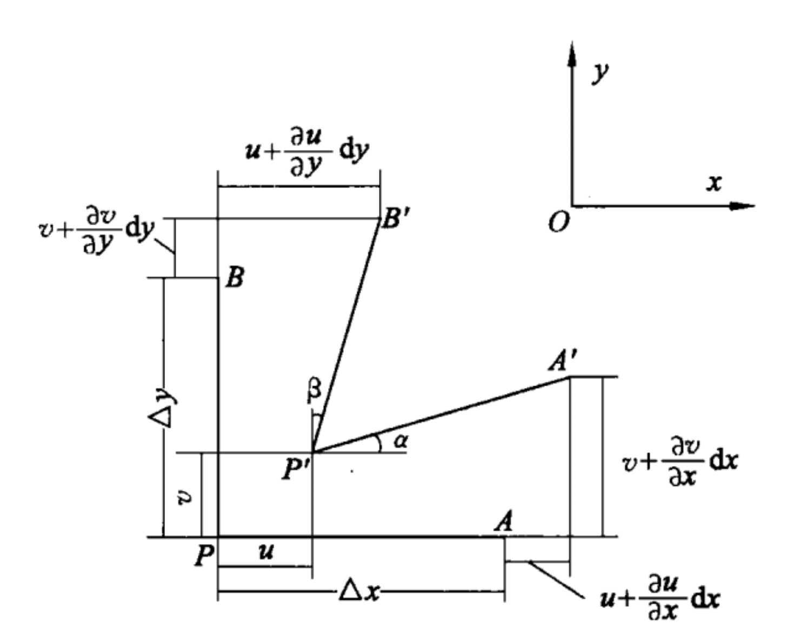

# 压电效应
这部分公式特别多，而markdown似乎不支持编号的行间公式，导致公式看起来很难受，还是原版pdf最舒服呜呜呜

PMUT至少包含4层结构，从上至下依次是顶电极(top electrode)、压电层(piezoelectric layer)、底电极(bottom electrode)、被动层(passive layer);
通过压电层的正压电效应(应变转换为电压)和逆压电效应(电压转换为应变)作为传感器（接收超声波）和执行器（产生超声波）。

## 压电方程
### 1.应力

 

先通过示意图回顾（且标定之后所使用的字母）应力和应变的各个分量的方向，以及应力张量和应变张量。
图为各应力的方向，应力矩阵（应力张量）表示为：

$$
\boldsymbol{\sigma} =
\begin{bmatrix}
    \sigma_{xx} & \tau_{xy} & \tau_{xz} \\
    \tau_{yx} & \sigma_{yy} & \tau_{yz} \\
    \tau_{zx} & \tau_{zy} & \sigma_{zz}
\end{bmatrix}
$$

若已知某点应力张量，则可以得到过该点任意面的作用力[^1]；
应力张量是对称矩阵[^2]，即$\tau_{xy}=\tau_{yx}$；

规定xx 为下标1，yy为下标2，zz 为下标3，yz, zy为下标4，xz, zx为下标5，xy, yx 为下标6。因此，应力矩阵在计算时可以表示为一个6×1矩阵，

$$
\boldsymbol{T} =
\begin{bmatrix}
    T_{1}  \\
    T_{2}  \\
    T_{3}  \\
    T_{4}  \\
    T_{5}  \\
    T_{6} 
\end{bmatrix}=
\begin{bmatrix}
    \sigma_{xx}  \\
    \sigma_{yy}  \\
    \sigma_{zz}  \\
    \tau_{yz}  \\
    \tau_{zx}  \\
    \tau_{xy}   
\end{bmatrix}
$$

### 2.应变

对于位置$\boldsymbol{r}$处的点发生位移$\boldsymbol{u}$，那么固体中相邻两点形变后的长度
$$dl^{2}=(dr_{1}+du_{1})^{2}+(dr_{1}+du_{1})^{2}+(dr_{1}+du_{1})^{2}$$
其中[^3]$$du_{1}=\frac{\partial u_{1}}{\partial r_{i}}dr_{i}$$
代入$dl$可得，$$dl^{2}=dr_{i}dr_{i}+2dr_{i}du_{i}+du_{i}du_{i}=
dr_{i}dr_{i}+2\frac{\partial u_{i}}{\partial r_{k}}dr_{i}dr_{k}+\frac{\partial u_{l}}{\partial r_{i}}\frac{\partial u_{l}}{\partial r_k}dr_{i}dr_{k}$$
忽略二阶项并写成对称的形式则可以得到$$dl^{2}=dr_{i}dr_{i}+2\epsilon _{ik}dr_{i}dr_{k},\ \epsilon_{ik}=\frac{1}{2}(\frac{\partial u_{i}}{\partial r_{k}}+\frac{\partial u_{k}}{\partial r_{i}})$$
 
可以看出应变张量的对角分量例如$\epsilon_{11}=\frac{\partial u_{1}}{\partial r_{1}}$为x方向自身的单位伸长；
非对角分量[^4]例如$\epsilon_{12}=\frac{1}{2}(\frac{\partial u_{1}}{\partial r_{2}}+\frac{\partial u_{1}}{\partial r_{2}})$为图所示的$\alpha+\beta$角度变化。

用矩阵表示得

$$
\boldsymbol{S} =
\begin{bmatrix}
    S_{xx} & S_{xy} & S_{xz} \\
    S_{yx} & S_{yy} & S_{yz} \\
    S_{zx} & S_{zy} & S_{zz}
\end{bmatrix}
$$

由于应变矩阵也为对称矩阵，同样规定xx 为下标1，yy为下标2，zz 为下标3，yz, zy为下标4，xz, zx为下标5，xy, yx 为下标6，应变矩阵在计算时可以表示为一个6×1矩阵，

$$
\boldsymbol{S} =
\begin{bmatrix}
    S_{1}  \\
    S_{2}  \\
    S_{3}  \\
    S_{4}  \\
    S_{5}  \\
    S_{6} 
\end{bmatrix}=
\begin{bmatrix}
    S_{xx}  \\
    S_{yy}  \\
    S_{zz}  \\
    S_{yz}  \\
    S_{zx}  \\
    S_{xy}   
\end{bmatrix}=
\begin{bmatrix}
    \frac{\partial u_{x}}{\partial r_{x}}\\
    \frac{\partial u_{y}}{\partial r_{y}}\\
    \frac{\partial u_{z}}{\partial r_{z}}\\
    \frac{1}{2}(\frac{\partial u_{y}}{\partial r_{z}}+\frac{\partial u_{y}}{\partial r_{z}})\\
    \frac{1}{2}(\frac{\partial u_{z}}{\partial r_{x}}+\frac{\partial u_{x}}{\partial r_{z}})\\
    \frac{1}{2}(\frac{\partial u_{x}}{\partial r_{y}}+\frac{\partial u_{y}}{\partial r_{x}})
\end{bmatrix}
$$

### 3.应力与应变之关系

**杨氏模量**

由胡克定律，对于x方向应力造成的拉伸
$$Y=\frac{T_{xx}}{S_{xx}}$$
应力应变关系
$$S_{1}=\frac{T_{1}}{Y_{11}},\ S_{2}=\frac{T_{2}}{Y_{22}},\ S_{3}=\frac{T_{3}}{Y_{33}}$$

**剪变模量**

剪应力导致剪应变，有如下关系
$$S_{4}=\frac{T_{4}}{G_{44}},\ S_{5}=\frac{T_{5}}{G_{55}},\ S_{4}=\frac{T_{6}}{G_{66}}$$

**泊松比**

仅施加x方向应力时也会导致y方向收缩，y收缩量与x方向伸长量的比为泊松比。
也就是说在施加x方向应力时，y方向的应变
$$S_{2}=-\nu \frac{T_{1}}{Y_{11}}$$

这样总应变可写为

$$
\begin{align}
S_{1} &=\frac{T_{1}}{Y_{11}}-\nu_{12}\frac{T_{2}}{Y_{22}}-\nu_{13}\frac{T_{3}}{Y_{33}}\\
S_{2} &=\frac{T_{2}}{Y_{22}}-\nu_{21}\frac{T_{1}}{Y_{11}}-\nu_{23}\frac{T_{3}}{Y_{33}}\\
S_{3} &=\frac{T_{3}}{Y_{33}}-\nu_{31}\frac{T_{1}}{Y_{11}}-\nu_{32}\frac{T_{2}}{Y_{22}}
\end{align}
$$

**系数关系**

对于各向同性材料，三个参量并不独立，有如下关系，推导省略详见力学教材：
$$G=\frac{Y}{2(1+\nu)}$$

### 4.两类压电方程

考虑压电性时有4个变量，第一对变量为力学的应变与应力$(S,T)$，第二对电学的电场电位移矢量与电场$(D,E)$，每对中各选一个变量作为自变量则会得到4组方程组叫做四类压电方程；
事实上，压电方程的严格推导是从绝热下热力学函数推导得来的，还考虑了材料的热力学量温度与熵$(\theta,\sigma)$，具体推导后文将不做展开(也没啥用想看自己看书)。
后文将只介绍第一类(d-型)和第二类(e-型)压电方程，第三四类几乎用不到。

**第一类压电方程(d-型压电方程)**

这里默认电磁学中学过电场、电极化矢量、电位移矢量，具体可参考电磁学教材。一般电介质材料满足关系如下$D_{i}=\epsilon_{ij}E_{j}$。

第一类压电方程选取电场与应力为自变量$(E,T)$，由于压电效应，电场将导致应变，因此应变的公式应写为

$$
S_{i}=d_{ji}E_{j}+s_{il}T_{l},\ \ (j=1,2,3,\ i,l=1,2\dots6)
$$

其中$d_{ij}$为压电应变常数[^5],是一个6$\times$3的矩阵，单位为$m/V$；对于六角晶系的PZT压电材料来说，它的压电应变常数只有三个独立量$d_{33},d_{31},d_{15}$，矩阵如下

$$
\boldsymbol{d} =
\begin{bmatrix}
    0 & 0 & 0 & 0 & d_{15} & 0 \\
    0 & 0 & 0 & d_{15} & 0 & 0 \\
    d_{31} & d_{31} & d_{33} & 0 & 0 & 0
\end{bmatrix}
$$

这样对于机械自由(即$T=0$后面会详细讲解边界条件)的PZT(锆钛酸铅，Lead Zirconate Titanate)的压电方程可写为

$$
\begin{bmatrix}
    S_{1} \\
    S_{2} \\
    S_{3} \\
    S_{4} \\
    S_{5} \\
    S_{6} 
\end{bmatrix} =
\begin{bmatrix}
    0 & 0 & d_{31} \\
    0 & 0 & d_{31} \\
    0 & 0 & d_{33} \\
    0 & d_{15} & 0 \\
    d_{15} & 0 & 0 \\
    0 & 0 & 0
\end{bmatrix}
\begin{bmatrix}
    E_{1} \\
    E_{2} \\
    E_{3} 
\end{bmatrix}
$$

从方程中可以看出仅给z方向的电场$E_{3}$就可以引起$S_{1}$和$S_{2}$即x,y两个方向的应变，并且应变大小的决定系数为$d_{31}$；
需要注意的是:压电方程有使用条件，不是任何条件下都有这样的线性压电性，对于PZT这种铁电材料来说在极化反转(即P=0的时候，后面会详细讲解铁电材料)时压电性会失效，
这是因为PZT内的铁电畴朝向相同方向才能赋予材料稳定的压电性能[^6]，极化反转时畴重新排列导致非弹性效应，d几乎为0，压电性能丧失。

应力将导致电位移(会导致顶底电极之间电压变化)，那么电位移的表达式可写为

$$
D_{i}=d_{ij}T_{j}+\epsilon_{ik}E_{k},\ \ (i,k=1,2,3;\ j=1,2\dots6)
$$

其中$d_{ij}$就是前面提到的压电应变常数，单位为$C/N(=m/V)$，正逆压电过程的系数是相同的是因为这两个过程（应力产生的极化与电场产生的形变）互为逆过程，
在压电方程的热力学推导时可以看到能量输入与输出必须对称。

综上，我们得到了第一类压电方程组(d-型压电方程)[^7]

$$
\left\{
\begin{aligned}
    S_{i} &= d_{ji}E_{j} + s_{il}^{E}T_{l}, \quad (j=1,2,3,\ i,l=1,2,\dots,6) \\
    D_{i} &= d_{ij}T_{j} + \epsilon_{ik}^{T}E_{k}, \quad (i,k=1,2,3;\ j=1,2,\dots,6)
\end{aligned}
\right.
$$

**第二类压电方程(e-型压电方程)**

第二类压电方程选取电场和应变为自变量，

$$
\left\{
\begin{aligned}
    T_{i} &= -e_{ji}E_{j} + c_{il}^{E}S_{l}, \quad (j=1,2,3,\ i,l=1,2,\dots,6) \\
    D_{i} &= e_{ij}S_{j} + \epsilon_{ik}^{S}E_{k}, \quad (i,k=1,2,3;\ j=1,2,\dots,6)
\end{aligned}
\right.
$$

其中，$e_{ij}$为压电应力常数，单位为$N/Vm,C/m^{2}$。此外，出现了一个负号是显然的，将$S=dE+sT$移项并乘矩阵的逆就有这个负号。
从方程中可以看出仅给z方向的电场$E_{3}$就可以引起$T_{1}$和$T_{2}$即x,y两个方向的应力，并且应力大小的决定系数为$e_{31}$；

**边界条件**

压电方程有如下四类边界条件，

| **边界条件类型** | **边界条件名称** | **边界条件** |
|-----------------|-----------------|-------------|
| 第一类边界条件 | 机械自由和电学短路 | $T = 0$; $E = 0$; $S \neq 0$; $D \neq 0$ |
| 第二类边界条件 | 机械夹持和电学短路 | $T \neq 0$; $E = 0$; $S = 0$; $D \neq 0$ |
| 第三类边界条件 | 机械自由和电学开路 | $T = 0$; $E \neq 0$; $S \neq 0$; $D = 0$ |
| 第四类边界条件 | 机械夹持和电学开路 | $T \neq 0$; $E \neq 0$ ;$S = 0$; $D = 0$ |

机械自由条件代表$T=0$，电学短路边界条件是指如果测量电路的电阻远小于晶片电阻，则可认为外电路处于短路状态，这时电极面上没有电荷积累，即晶片内的电场$E=0(\text{或常数})$，这样的电学边界条件称为电学短路边界条件。

### 5.薄膜压电系数

薄膜压电系数就是考虑压电薄膜被约束在基底上这一边界条件时，计算各个模态(33或31模态)下的力电学量比值$e_{xx,f}=T/E$与$d_{xx,f}=S/E$；

$\mathbf{d_{33,f}}$

上文中的压电应变常数$d_{ij}$表征的是机械完全自由边界($T_{1,2,3}=0$)下应变与电场之比。但是薄膜会被约束在基底上，
因此我们要单独定义被约束的薄膜压电应变系数，加以额外的弹性约束修正；

对于**PZT材料**逆压电效应(inverse piezoelectric (ip) effect，电场导致应变)的33模态（注意，这并不是PMUT一般的工作模态），定义如下薄膜压电系数

$$
d_{33,f}(ip)=\frac{S_{3}}{E_{3}}=d_{33}-\frac{2s_{13}^{E}}{s_{11}^{E}+s_{12}^{E}}d_{31}=\frac{e_{33}}{c_{33}^{E}}
$$

推导如下，仅施加电场$E_{3}$,则$E_{1},E_{2}=0$，由于薄膜被约束$S_{1}=0,S_{2}=0$,z方向机械自由$T_{3}=0$，由于对称性$T_{1}=T_{2}$，根据(2.9)式1可以得到
$$0=T_{3}=-e_{33}E_{3}+c_{33}^{E}S_{3} \text{，\ 得}\frac{S_{3}}{E_{3}}=\frac{e_{33}}{c_{33}^{E}}$$
根据(2.8)式还可以列出

$$
\left\{
\begin{aligned}
    0=S_{1} &= d_{31}E_{3} + s_{11}^{E}T_{1}+ s_{12}^{E}T_{2}, \\
    0=S_{2} &= d_{32}E_{3} + s_{21}^{E}T_{1}+ s_{22}^{E}T_{2}, \\
    S_{3} &= d_{33}E_{3} + s_{31}^{E}T_{1}+ s_{32}^{E}T_{2}, 
\end{aligned}
\right.
$$

代入PZT的$s^{E}$与$d$矩阵

$$
\mathbf{s}^{E} =
\begin{bmatrix}
s_{11} & s_{12} & s_{13} & 0 & 0 & 0 \\
s_{12} & s_{11} & s_{13} & 0 & 0 & 0 \\
s_{13} & s_{13} & s_{33} & 0 & 0 & 0 \\
0 & 0 & 0 & s_{44} & 0 & 0 \\
0 & 0 & 0 & 0 & s_{44} & 0 \\
0 & 0 & 0 & 0 & 0 & 2(s_{11}-s_{12})
\end{bmatrix},\ 
\boldsymbol{d} =
    \begin{bmatrix}
        0 & 0 & 0 & 0 & d_{15} & 0 \\
        0 & 0 & 0 & d_{15} & 0 & 0 \\
        d_{31} & d_{31} & d_{33} & 0 & 0 & 0
    \end{bmatrix}
$$

化简得到

$$
\left\{
\begin{aligned}
    0 &= d_{31}E_{3} + (s_{11}^{E}+s_{12}^{E})T_{1}, \\
    0 &= d_{31}E_{3} + (s_{12}^{E}+ s_{11}^{E})T_{1}, \\
    S_{3} &= d_{33}E_{3} + 2s_{13}^{E}T_{21}, 
\end{aligned}
\right.
$$

解得
$$\frac{S_{3}}{E_{3}}=d_{33}-\frac{2s_{13}^{E}}{s_{11}^{E}+s_{12}^{E}}d_{31}$$

对于**PZT材料**正压电效应(direct piezoelectric (dp) effect，应变导致电场)的33模态，定义如下薄膜压电系数，其中$\sigma$为泊松比，$Y$为杨氏模量

$$
d_{33,f}(dp)=\frac{D_{3}}{T_{3}}=d_{33}-\frac{2s_{13}^{E}+\sigma/Y}{s_{11}^{E}+s_{12}^{E}}d_{31}
$$

推导只需将(2.11)式中的$S_{1},S_{2}=0$改为$S_{1}=S_{2}=-\frac{\sigma}{Y}T_{3}$即可得到结果。

$\mathbf{e_{31,f}}$

对于逆压电效应(inverse piezoelectric (ip) effect，电场导致应力)的31模态，定义如下薄膜压电系数

$$
e_{31,f}=-\frac{T_{1}}{E_{3}}=e_{31}-\frac{c_{13}^{E}}{c_{33}^{E}}e_{33}=\frac{d_{31}}{s_{11}^{E}+s_{12}^{E}}
$$

推导如下，仅施加电场$E_{3}$,则$E_{1},E_{2}=0$，由于薄膜被约束（这是一种薄膜被Si衬底钳制住的近似）$S_{1}=0,S_{2}=0$,z方向机械自由$T_{3}=0$，由于对称性$T_{1}=T_{2}$
$$0=S_{1}=d_{31}E_{3}+s_{11}^{E}T_{1}+s_{12}^{E}T_{2},\ \text{得}-\frac{T_{1}}{E_{3}}=\frac{d_{31}}{s_{11}^{E}+s_{12}^{E}}$$
由(2.9)式1可得

$$
\left\{
\begin{aligned}
    T_{1} &= -e_{31}E_{3} + c_{31}^{E}S_{3},\\
    0 = T_{3} &= -e_{33}E_{3} + c_{33}^{E}S_{3}
\end{aligned}
\right.
$$

联立得$$-\frac{T_{1}}{E_{3}}=e_{31}-\frac{c_{13}^{E}}{c_{33}^{E}}e_{33}$$

值得注意的是，矩阵c,s与泊松比$\nu$之间有一定关系，代入前文应力应变部分的推导可以得到我们更常用的
$$e_{31,f}=e_{31}-\nu_{12}e_{33}=\frac{d_{31}}{s_{11}^{E}+s_{12}^{E}}$$

## 压电材料选择
事实上，不管$d_{31}$还是$e_{31}$都同时表征了正压电效应和逆压电效应，因为前文提到了这两个过程是可逆的所以系数是相同的。

$d_{31}:E\rightarrow S,T\rightarrow D$

$e_{31}:E\rightarrow T,S\rightarrow D$

### 1.传感器接收灵敏度

将$e_{31,f}$及$d_{33,f}$代入$D_{3}$，由于薄膜被约束$S_{1}=0,S_{2}=0$

$E_{1},E_{2}=0$得

$$D_{3} = \epsilon_{0}\epsilon_{33,f}E_{3} +e_{31,f}(S_{1} +S_{2})+d_{33,f}T_{3}$$

作为传感器时，接收灵敏度（sensing sensitivity）$G_{s}$可认为应变导致的电压变化，则$G_{s}$正比于$e_{31.f}$(代表应变转化为电位移)，反比于$\epsilon_{31,f}$(代表电位移转化为电场),
因此$$G_{s}\propto \frac{e_{31,f}}{\epsilon_{33,f}}$$

### 2.执行器发射灵敏度

仅施加电场$E_{3}$,则$E_{1},E_{2}=0$，由于薄膜被约束[^8]$S_{1}=0,S_{2}=0$,z方向机械自由$T_{3}=0$，由于对称性$T_{1}=T_{2}$，根据式(2.15)可以得到

$$T_{1,2}=e_{31,f}E_{3}$$

因此作为执行器时，发射灵敏度（transmitting sensitivity）$G_{t}$
$$G_{t}\propto {e_{31,f}}=e_{31}-\frac{c_{13}^{E}}{c_{33}^{E}}e_{33}=\frac{d_{31}}{s_{11}^{E}+s_{12}^{E}}$$
 
### 3.位移灵敏度(Displayment sensitivity)
代表发射时施加单位电压测得振动位移，单位一般为nm/V。

The End.

Footnotes:
[^1]: 这一点其实并不重要，可以设想该面与xy,yz,zx面形成的正四面体受力平衡得到这一结论
[^2]: 这是由力矩平衡得到，例如$\tau_{yz}dxdydz - \tau_{zy}dxdydz = 0$
[^3]: 这里采用了Einstein指标记法省略求和号，例如$a_{i}b_{i}=a_{1}b_{1}+a_{2}b_{2}+a_{3}b_{3}$
[^4]: 从代数的角度看，出现$\frac{1}{2}$的原因是$dl^{2}$这个式子$\epsilon_{ik}$前面我们必须要提出一个2，这样算dl的变化量开根号小量近似时会出来个$\frac{1}{2}$(根号的泰勒展开导致)与这个2消掉
[^5]: 压电方程中是$d_{ji}$代表压电应变常数的转置，所以正常按照指标收缩来讲本应第二个指标代表电场方向，但是由于这个转置的定义实际上第一个指标代表电场方向，第二个指标代表应变方向
[^6]: 这也是为什么做实验时要先将PZT-PMUT先加一段时间与材料极化方向一致的直流偏置进行充分极化，这样有更稳定的压电性
[^7]: 这里添加了上标$s_{il}^{E},\epsilon_{ik}^{T}$这是代表顺度系数和介电常数是指$E$和$T$不变下偏导得到的，叫做短路顺度弹性系数和自由介电常数
[^8]: 事实上，PMUT压电层向下弯曲时是有x,y方向的应变的，但是这个应变相对于z方向应变为二阶量
